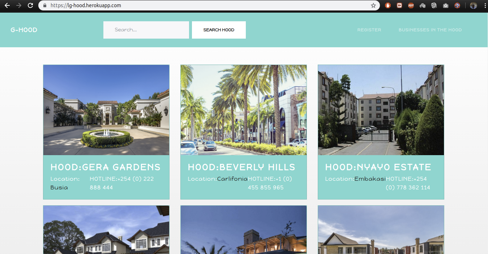
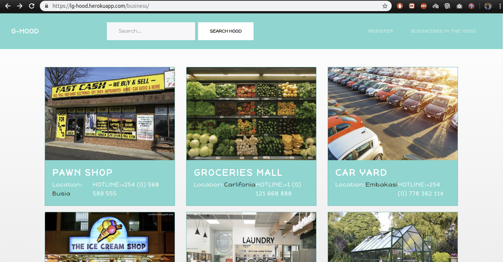
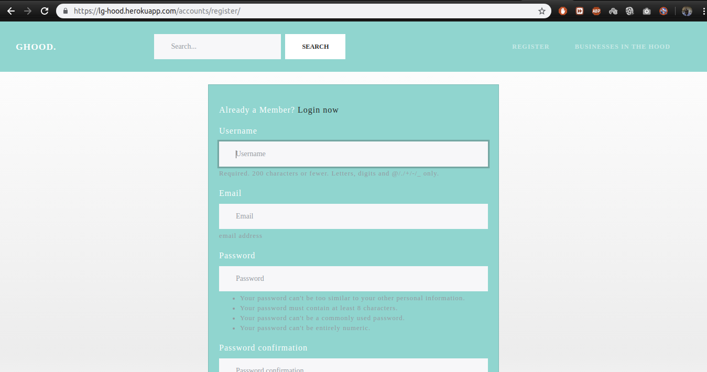
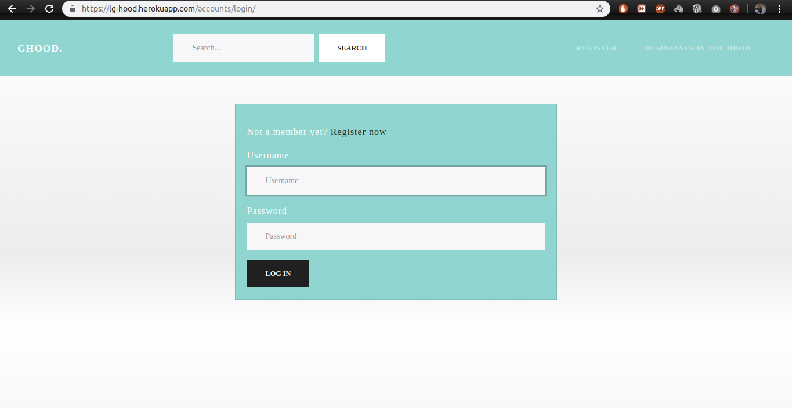

# La Casa De Papel

#### This is a simple Web Application that showcases different neighborhoods.

#### By **Lugaga Maurice Ngulu**

## The Web Application Screengrabs.

* Home Page

* Biz In The Hood Page

* User Registeration | Sign Up Page

* User Login Page

## Description
This is a simple Web Application that showcases different neighborhoods.

## Setup/Installation Requirements
* Fork the data onto your own personal repository.
* Clone Project to your machine git clone `git clone`
* Activate a virtual environment on terminal: `source virtual/bin/activate`
* Install all the requirements found in requirements file.
* On your terminal run `python manage.py runserver`
* Access the live site using the local host provided
* Or access the live website by clicking on [Le Casa De Papel](https://lg-hood.herokuapp.com/)

## Known Bugs
No Bugs

## Technologies Used
* Google Fonts
* CSS for styling.
* HTML for webpage design.
* Python3.6.
* Django 1.11.5

## Dependencies
* pip

## Tech Support

* Telephone: +254 (0) 777 685 128
* Email: maureegaga@outlook.com

### License and Copyright details
* The MIT License [MIT](LICENSE)
* Copyright (c) 2019 **Engineer Lugaga**
